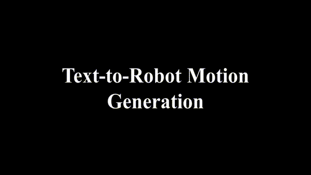

# T2QRM: Text-Driven Quadruped Robot Motion Generation (ACM Multimedia Asia 2024)

This is the official codebase and dataset of T2QRM: Text-Driven Quadruped Robot Motion Generation, ACM Multimedia Asia 2024.

## Introduction
Learning animal-like agility and diverse locomotion is a challenge in controlling quadrupedal robots. 
Traditional motion design methods for robots require substantial expertise in biological locomotion, 
making the process challenging and time-consuming. Establishing connections between robot motions and human language is 
also crucial for effective human-robot interaction and learning the semantic features inherent in robot motions. 
To address these challenges, we propose a text-driven quadrupedal robot motion generation framework (T2QRM) to 
generate realistic and diverse animal-like motions in simulation. The framework also incorporates reinforcement learning 
policies, enhancing the robot's adaptability to interact with the physical world. 
Recognizing the importance of long sequence generation and high-frequency control in robot interactions, 
we introduce a novel FrameEncoder to overcome the challenge of generating appropriate and variable-length sequences. 
Additionally, we present the first Dog Motion-Language (DogML) dataset, 
consisting of 8,048 clips of dog motions and corresponding quadruped robot motions, 
annotated with eight action classes and accompanied by 12,072 textual descriptions.

## Code
Our code will be released as soon as possible.

## Dataset
For our DogML dataset, you could directly download [[Here].](https://drive.google.com/drive/folders/1kMlJPIM0vNosFU3SN_K3F0X1dH1RzgL8?usp=sharing)

## Contact
Minghui Wang \
Biometrics and Intelligence Perception Lab \
College of Automation Science and Engineering \
South China University of Technology \
Wushan RD.,Tianhe District,Guangzhou,P.R.China,510641 \
Email: aulada@mail.scut.edu.cn